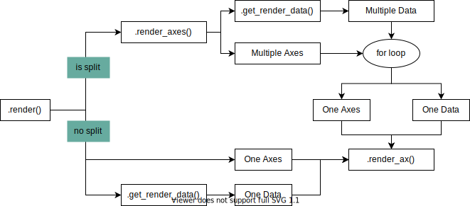

Let's make custom visualization for marsilea
============================================

The built-in plotting options in Marsilea
may not be perfect for your presentation.
This section will show you how to create your own visualization.
It's expected that you are familiar with Python's class inheritance.

Everything render on the canvas in Marsilea is derived from
:class:`RenderPlan <marsilea.plotter.base.RenderPlan>`.
To create a new visualization, we also need to inherit from
:class:`RenderPlan <marsilea.plotter.base.RenderPlan>`.

Let's create a Lollipop plot as example:

.. code-block:: python

    from marsilea import RenderPlan

    class Lollipop(RenderPlan):
        pass

The current `Lollipop` does nothing,
it does not know how to draw a lollipop.

.. plot::
    :context: close-figs
    :include-source: false

        >>> from marsilea.base import RenderPlan

        >>> class Lollipop(RenderPlan):
        ...     pass

.. plot::
    :context: close-figs

        >>> import marsilea as ma

        >>> h = ma.Heatmap(np.random.rand(10, 10))
        >>> h.add_top(Lollipop())
        >>> h.render()

We need to implement the `render` method.
The `render` method takes one argument, which is the `Axes`
where we do all the drawing.

.. code-block:: python

    class Lollipop(RenderPlan):

        def __init__(self, data):
            self.data = data

        def render(self, ax):
            lim = len(self.data)
            locs = np.arange(lim) + 0.5
            ax.stem(locs, self.data, basefmt="none")
            ax.set_axis_off()

.. plot::
    :context: close-figs
    :include-source: false

        >>> from marsilea.base import RenderPlan

        >>> class Lollipop(RenderPlan):
        ...
        ...     def __init__(self, data):
        ...         self.data = data
        ...
        ...     def render(self, ax):
        ...         lim = len(self.data)
        ...         locs = np.arange(lim) + 0.5
        ...         ax.stem(locs, self.data, basefmt="none")
        ...         ax.set_axis_off()
        ...

.. plot::
    :context: close-figs

        >>> import marsilea as hg
        >>> data = np.random.rand(10, 10)
        >>> lp_data = np.arange(10) + 1
        >>> h = hg.Heatmap(data)
        >>> h.add_top(Lollipop(lp_data))
        >>> h.render()

But what if I want to add it to the left.

.. plot::
    :context: close-figs

    >>> h = hg.Heatmap(data)
    >>> h.add_left(Lollipop(lp_data))
    >>> h.render()

Oh no, it's broken! Let's try to fix it.

.. code-block:: python

    class Lollipop(RenderPlan):

        def __init__(self, data):
            self.data = data

        def render(self, ax):
            lim = len(self.data)
            locs = np.arange(lim) + 0.5
            orientation = "vertical" if self.is_body else "horizontal"
            ax.stem(locs, self.data, basefmt="none")
            ax.set_axis_off()
            if self.side == "left":
                ax.invert_xaxis()
            if self.is_flank:
                ax.invert_yaxis()

Here we use the `is_body` attribute to query the side,
here is a list of attributes that you can use to know
which side that the :class:`RenderPlan <marsilea.plotter.base.RenderPlan>` is drawn.

- :attr:`.side <marsilea.plotter.base.RenderPlan.side>`: Get the current side of the RenderPlan
- :attr:`.is_body <marsilea.plotter.base.RenderPlan.is_body>`: Top, Bottom or Main
- :attr:`.is_flank <marsilea.plotter.base.RenderPlan.is_flank>`: Left or Right

.. plot::
    :context: close-figs
    :include-source: false

    >>> class Lollipop(RenderPlan):
    ...
    ...    def __init__(self, data):
    ...        self.data = data
    ...
    ...    def render(self, ax):
    ...        lim = len(self.data)
    ...        locs = np.arange(lim) + 0.5
    ...        orientation = "vertical" if self.is_body else "horizontal"
    ...        ax.stem(locs, self.data, basefmt="none", orientation=orientation)
    ...        ax.set_axis_off()
    ...        if self.side == "left":
    ...           ax.invert_xaxis()
    ...        if self.is_flank:
    ...             ax.invert_yaxis()
    ...

We make the orientation changed when the `Lollipop` is rendered on different
side of heatmap.

Now we try add it to the left again.

.. plot::
    :context: close-figs

    >>> h = hg.Heatmap(data)
    >>> h.add_left(Lollipop(lp_data))
    >>> h.render()

Make a legend
-------------

If your :class:`RenderPlan <marsilea.plotter.base.RenderPlan>` need to have legends,
you need to implement the
:meth:`get_legends <marsilea.plotter.base.RenderPlan.get_legends>`.

.. note::

.. code-block:: python
    :emphasize-lines: 21, 22, 23, 24, 25

    >>> from legendkit import CatLegend
    >>>
    >>> class Lollipop(RenderPlan):
    ...
    ...    def __init__(self, data):
    ...        self.data = data
    ...
    ...    def render(self, ax):
    ...        lim = len(self.data)
    ...        locs = np.arange(lim) + 0.5
    ...        orientation = "vertical" if self.is_body else "horizontal"
    ...        ax.stem(locs, self.data, basefmt="none", orientation=orientation)
    ...        ax.set_axis_off()
    ...        if self.side == "left":
    ...            ax.invert_xaxis()
    ...        if self.is_flank:
    ...             ax.invert_yaxis()
    ...
    ...    def get_legends(self):
    ...        return CatLegend(colors=["b"], labels=["Lollipop"], handle="circle")
    ...

We also develop another package called `legendkit <https://legendkit.readthedocs.io/en/latest/>`_ to help
you handle legend easily. Consider using it.

.. plot::
    :context: close-figs
    :include-source: false

    >>> from legendkit import CatLegend
    >>>
    >>> class Lollipop(RenderPlan):
    ...
    ...    def __init__(self, data):
    ...        self.data = data
    ...
    ...    def render(self, ax):
    ...        lim = len(self.data)
    ...        locs = np.arange(lim) + 0.5
    ...        orientation = "vertical" if self.is_body else "horizontal"
    ...        ax.stem(locs, self.data, basefmt="none", orientation=orientation)
    ...        ax.set_axis_off()
    ...        if self.side == "left":
    ...            ax.invert_xaxis()
    ...        if self.is_flank:
    ...             ax.invert_yaxis()
    ...
    ...    def get_legends(self):
    ...        return CatLegend(colors=["b"], labels=["Lollipop"], handle="circle")
    ...

.. plot::
    :context: close-figs

    >>> h = hg.Heatmap(data)
    >>> h.add_left(Lollipop(lol_data))
    >>> h.add_legends()
    >>> h.render()

The Marsilea will automatically handle all the legends for you.

Create splittable `RenderPlan`
------------------------------

Here we are going to dive into more advance topic,
if you try to split heatmap with the Lollipop, it didn't work.

.. plot::
    :context: close-figs

    >>> h = hg.Heatmap(data)
    >>> h.vsplit(cut=[5])
    >>> h.add_left(Lollipop(lol_data))
    >>> h.render()

When the render plan gets render, the `ax` parameter is not
guarantee to be single :class:`Axes <matplotlib.axes.Axes>`, there will be multiple
:class:`Axes <matplotlib.axes.Axes>` when it gets split.

The simply way to refactor our `Lollipop` is to implement a method
:meth:`render_ax <marsilea.plotter.base.RenderPlan.render_ax>`.
It takes two paramters, an axes to be drawn and the data that are already split.

.. plot::
    :context: close-figs

        >>> from marsilea.plotter.base import StatsBase
        >>>
        >>> class Lollipop(StatsBase):
        ...
        ...    def __init__(self, data):
        ...        self.data = data
        ...
        ...    def render_ax(self, ax, data):
        ...        lim = len(data)
        ...        locs = np.arange(lim) + 0.5
        ...        orientation = "vertical" if self.is_body else "horizontal"
        ...        ax.stem(locs, data, basefmt="none")
        ...        ax.set_axis_off()
        ...        if self.side == "left":
        ...            ax.invert_xaxis()
        ...        if self.is_flank:
        ...             ax.invert_yaxis()
        ...        ax.set_xlim(0, locs[-1]+.5)
        ...

        >>> h = hg.Heatmap(data)
        >>> h.vsplit(cut=[5])
        >>> h.add_top(Lollipop(np.arange(10) + 2))
        >>> h.render()

What's happening under the hood is clearly illustrated in the flowchart below.

Here, the :meth:`render_ax <marsilea.plotter.base.RenderPlan.render_ax>`
define the behavior on how to render on each `Axes` with each chunk of `data`.
Marsilea will automatically handle the split and data for you. If you want to handle the splitting
process, you can overwrite the :meth:`get_render_data <marsilea.plotter.base.RenderPlan.get_render_data>`
method.

Great, hope you get the idea on how to implement your visualization.

